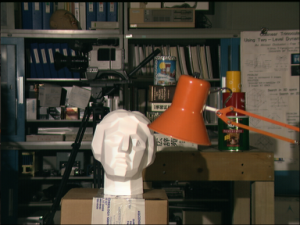

# python-bp-disparity-maps
Computing Disparity-maps of images using loopy-belief-propogation algorithm

Requirements :
```
python-3.X
numpy
python-opencv-2
```

To run the program:
```
python main.py -imageno [IMAGE_NO] -maxdisp [MAX_DISP_ALLOWED] -smoothing [SMOOTHENING_CONSTANT]
```

## Program-Specifications
* First the given images are loaded & converted to grayscale, then	`VariableNodes` and FactorNodes are initialized. Since the `UnaryNode` always returns the same message at each iteration it has been stored for efficiency.
* Then we perform iterations, in each function `Propogate` is called which basically calls the `buildBelief` function of all `VariableNodes`. It inturn uses the precomputed unarynode message, and receives message from `PairWiseFactorNode` objects it is associated with.
* Then message from Unary Node is a numpy array of size max disparity, and each element corresponds to the pixel magnitude difference at offset corresponding to that index
* The message from `PairWiseFactorNode` is equal to a numpy array with all ones except at disparity of other associated VariableNode, where it is 0 and this numpy array is scaled up by smoothing factor / lambda. 
i.e. =>
```
CostArray = np.ones(MAX_DISP) * smoothing
CostArray[OTHER_NODE_DISP] = 0
```

## Results
 